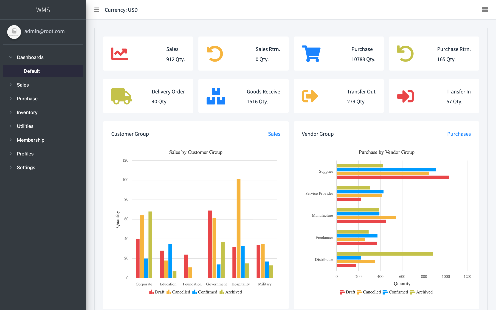
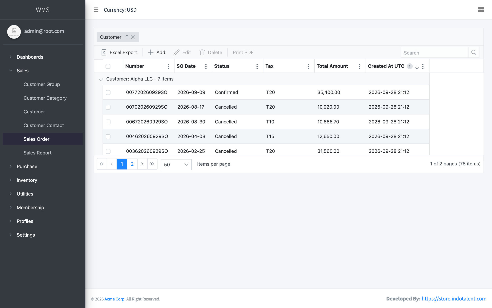
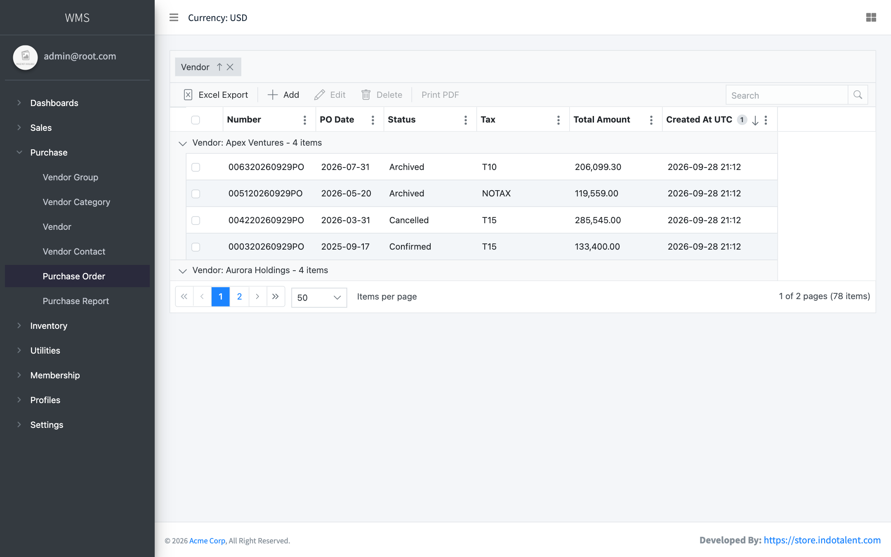
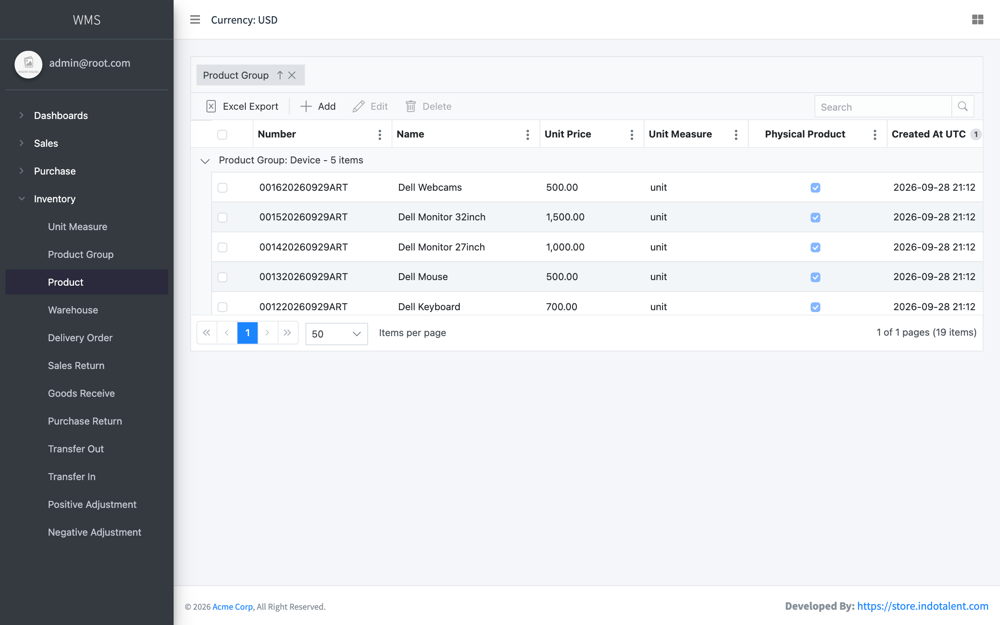
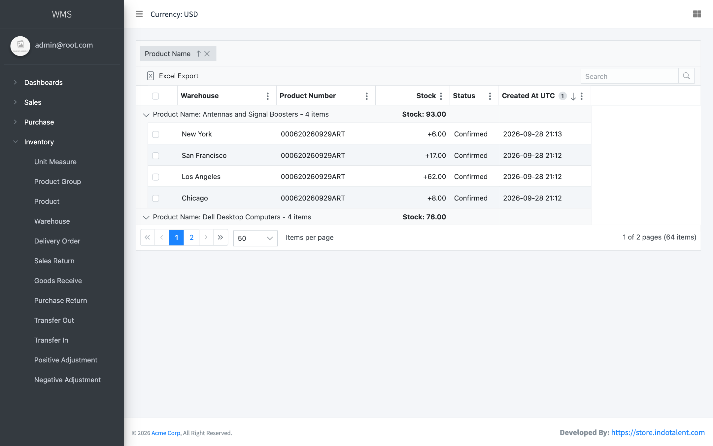
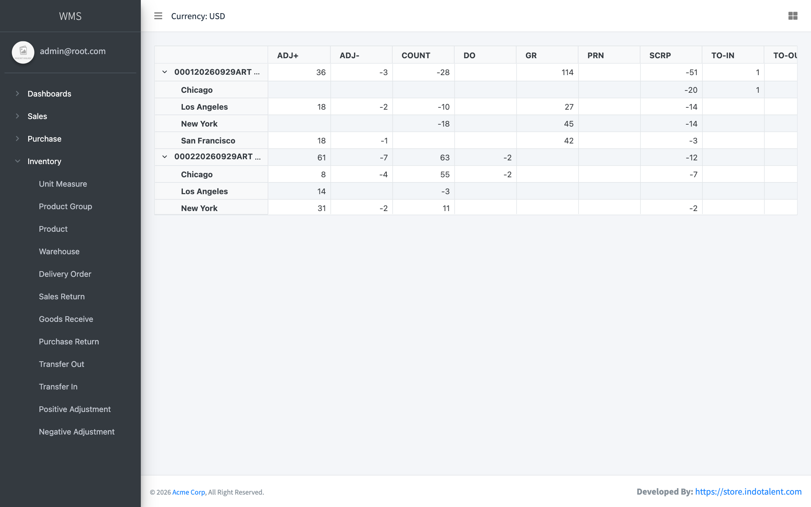
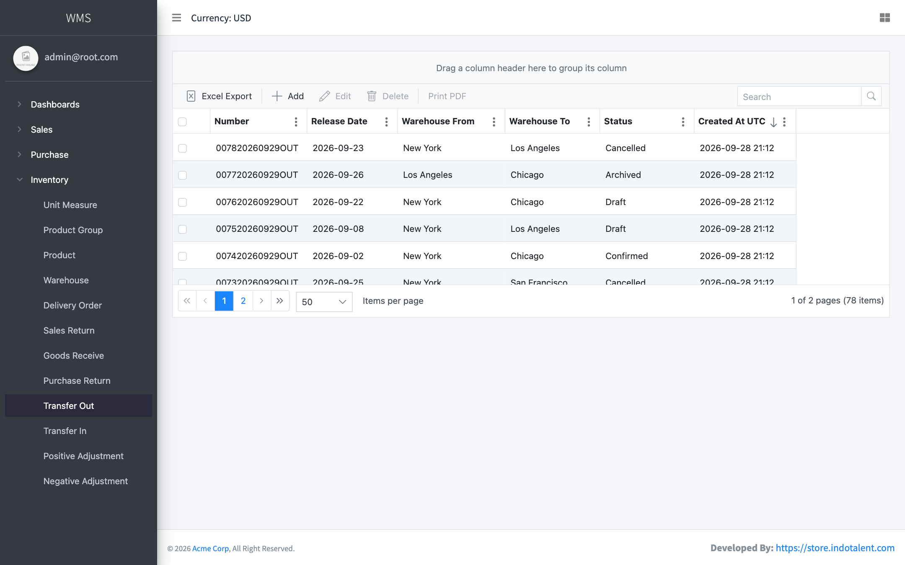

# Inventory & Order Management System (WMS)

[](https://github.com/Khushal-Narsaria/Inventory-Order-Management-System/actions/workflows/build.yml)
[](https://khushal-narsaria.github.io/Inventory-Order-Management-System/)


[](LICENSE.txt)

<!-- live-links -->
> 🔗 **Live project page:** [khushal-narsaria.github.io/Inventory-Order-Management-System](https://khushal-narsaria.github.io/Inventory-Order-Management-System/)  
> 👤 **Portfolio:** [khushal-narsaria.github.io](https://khushal-narsaria.github.io/)  
<!-- live-links -->

A warehouse and order management system built on an **ASP.NET Core 9** headless API with **Clean Architecture**, **CQRS (MediatR)** and the **Repository pattern**. The Razor Pages + Vue.js front end covers the full inventory lifecycle: sales, purchasing, stock movements between warehouses, and reporting.



## Features

| Module | Capabilities |
|---|---|
| **Sales** | Customers (groups, categories, contacts), sales orders, sales returns, delivery orders, sales reports |
| **Purchase** | Vendors (groups, categories, contacts), purchase orders, purchase returns, goods receipt, purchase reports |
| **Inventory** | Warehouses, products and groups, units of measure, transfer out/in, positive/negative adjustments, scrapping, stock counts |
| **Reports** | Stock report, movement report, transaction report, printable PDFs for every document |
| **Platform** | ASP.NET Identity + JWT with role-based access, users and roles, company settings, taxes, number sequences, Excel export, error/analytics logs |

## Screenshots

| Sales orders | Purchase orders |
|---|---|
|  |  |

| Products | Stock report |
|---|---|
|  |  |

| Movement report | Transfer out |
|---|---|
|  |  |

## Architecture

```
Presentation/ASPNET      Web API controllers + Razor Pages front end (Vue.js, Syncfusion grids, AdminLTE)
        │  MediatR requests
Core/Application         CQRS commands & queries, handlers, FluentValidation, AutoMapper profiles
        │
Core/Domain              Entities and business rules (products, warehouses, orders, stock movements)
        │
Infrastructure           EF Core contexts + repositories, ASP.NET Identity + JWT, Serilog, file storage, seeding
```

Each request flows **UI (Axios) → API controller → MediatR command/query → validation → handler → repository → EF Core**, with Serilog logging throughout.

## Run locally

Requirements: [.NET 9 SDK](https://dotnet.microsoft.com/download).

**Quick start with SQLite (no database server needed):**

```bash
git clone https://github.com/Khushal-Narsaria/Inventory-Order-Management-System.git
cd Inventory-Order-Management-System/Presentation/ASPNET
DatabaseProvider=Sqlite ConnectionStrings__DefaultConnection="Data Source=whms.db" dotnet run
```

On Windows PowerShell, set the two variables with `$env:DatabaseProvider="Sqlite"` and `$env:ConnectionStrings__DefaultConnection="Data Source=whms.db"`.

Open http://localhost:5000 and sign in with the seeded admin: **admin@root.com / 123456**. On first start the database is created and filled with demo customers, vendors, products and a year of transactions (`IsDemoVersion` in `appsettings.json`).

**With SQL Server:** set `DefaultConnection` in `Presentation/ASPNET/appsettings.json` to your server and run `dotnet run`. `DatabaseProvider` defaults to `SqlServer`.

## Tech stack

| Layer | Technologies |
|---|---|
| Back end | ASP.NET Core 9 Web API, MediatR (CQRS), FluentValidation, AutoMapper, Serilog, Swagger |
| Data | Entity Framework Core 9 with SQL Server or SQLite, Repository + Unit of Work |
| Security | ASP.NET Identity, JWT bearer tokens, role-based authorization |
| Front end | Razor Pages, Vue.js (no build step), Axios, Syncfusion EJ2 grids and charts, AdminLTE |
| CI | GitHub Actions: `dotnet build` on every push |

## Changes in this repository

- Added a **SQLite** database provider (`DatabaseProvider=Sqlite`) so the app runs on macOS/Linux without SQL Server. Verified locally: schema creation, demo-data seeding, login and all modules.
- Added a GitHub Actions build and this documentation.

## Credits & license

This project is based on **WHMS by [Indotalent](https://store.indotalent.com)** (warehouse and inventory management system, .NET 9), licensed under [Creative Commons Attribution 4.0](LICENSE.txt).

## Author

**Khushal Narsaria** · [Portfolio](https://khushal-narsaria.github.io/) · [LinkedIn](https://www.linkedin.com/in/khushal-narsaria/) · [GitHub](https://github.com/Khushal-Narsaria)
